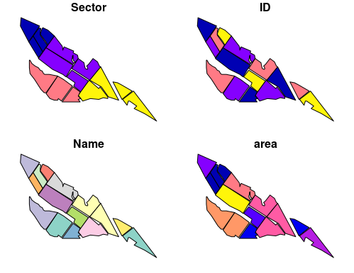
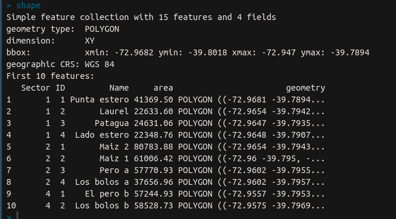
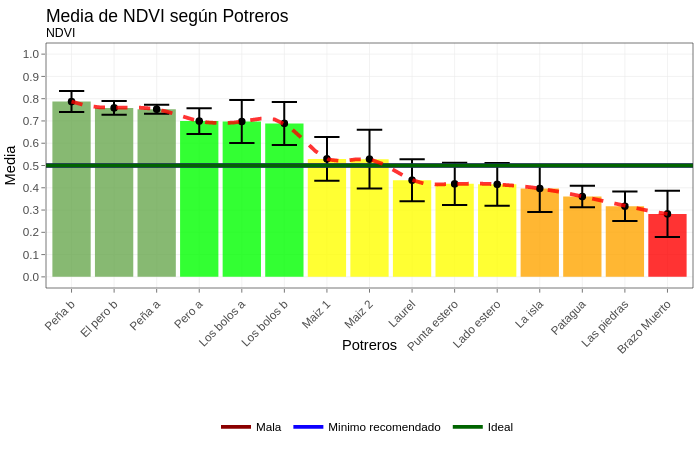
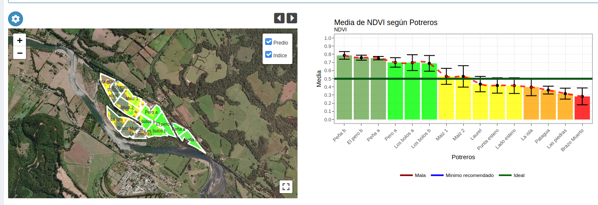

# intern-test

## Bienvenidos

Este repositorio fue creado para evaluar diferentes habilidades entre los postulantes a prácticas I, II y profesionales en [Agro Space](https://agrospace.cl) y [Bloom Alert](https://bloomalert.com) 

A continuación se presentan ciertos ejercicios que evalúan su comprensión en las áreas de:

  1. Manipulación de datos satelitales y capas vectoriales 
  2. Análisis y visualización de datos
  3. Interpretación de resultados
  4. Creación de cartografías
  5. Desarrollo informático general
  
## Introducción

La geomática es un área de la ciencia que utiliza objetos espacialmente distruibidos (rasters y vectores) para tomar desiciones en relación su comportamiento en el espacio. La percepción remota y los sistemas de información geográfica (SIG) son dos disciplinas de esta temática que sirven para caracterizar el medio ambiente y otras áreas similares. 

En este práctico, usted deberá analizar una serie temporal de datos satelitales y extraer la información asociada a polígonos o capas vectoriales (.shapefiles o .geojson). Los datos satelitales corresponden a matrices o raster de pixeles, con valores de una variable en espécifico. 

### Capa Raster

### Capa Vectorial

La capa vectorial contiene 'geometrias' que tienen asignado un 'Name'. Tales como Punta estero, Laurel o Patagua, entre otros. 

## Promedio por potrero

## time series

## GIF

## Ejercicio
 1) Descargar los datos satelitales (.tif) en la carpeta raster:
  - [raster.tar.gz](https://github.com/Tartomas/intern-test/tree/main/raster)
  - [.rar en GoogleDrive](https://drive.google.com/file/d/1uSzseg6t0MnjMBQ59ENwQ2qk4h6zABA7/view?usp=sharing)
 2) Extraer las series temporales según el .geojson o .kml
 3) Calcular estadísticas descriptivas, promedios, desviaciones estándar y intercuartiles para cada *potrero*
 4) Graficar el índice NDVI para 2 fechas (las que usted quieras) y determinar que potrero es el más productivo
 5) Generar una cartografía con leyenda y escala espacial. Pueden hacelro en python, R o QGIs.
 6) Generar una serie temporal de cada potrero
 7) Craer un modelo lineal y un modelo de ML para estimar el NDVI de cada potrero. 
  - Calcular el R2 y RMSE
 8) Crear una REST API utilizando [FLASK](https://flask.palletsprojects.com/en/1.1.x/), [PLUMBER](https://www.rplumber.io/), [RestRserve](https://restrserve.org/) o [FastAPI](https://fastapi.tiangolo.com/) o cualquier que sea de su gusto. 
  - Generar 2 endpoint
    1) visualizar un leaflet del mapa
    2) visualizar la data en formato .json
 9) Crear un .GIF con los raster de la serie temporal 
 

### Consideraciones
 - Tiempo para realizar la entrega: 24 horas 
 - Formato de entrega: PDF, ppt, jupyter, .md, etc. 
 - Pueden subirlo como branch en el repo o enviar un correo a [tomasacuna@ug.uchile.cl](mailto:tomasacuna@ug.uchile.cl)
 - Complete todos los ejercicios **que pueda** y si necesita más tiempo, no hay problema. 

## ¿Sabía usted?

Todo esto lo hacemos automáticamente con el [Dashboard de AgroSpace](https://dash.agrospace.cl)

